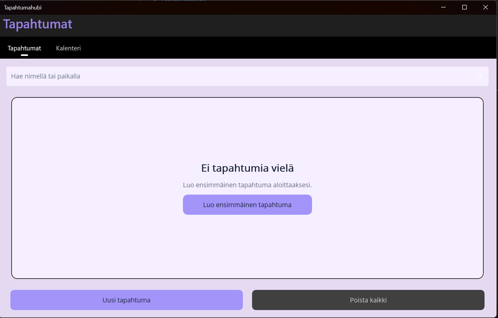
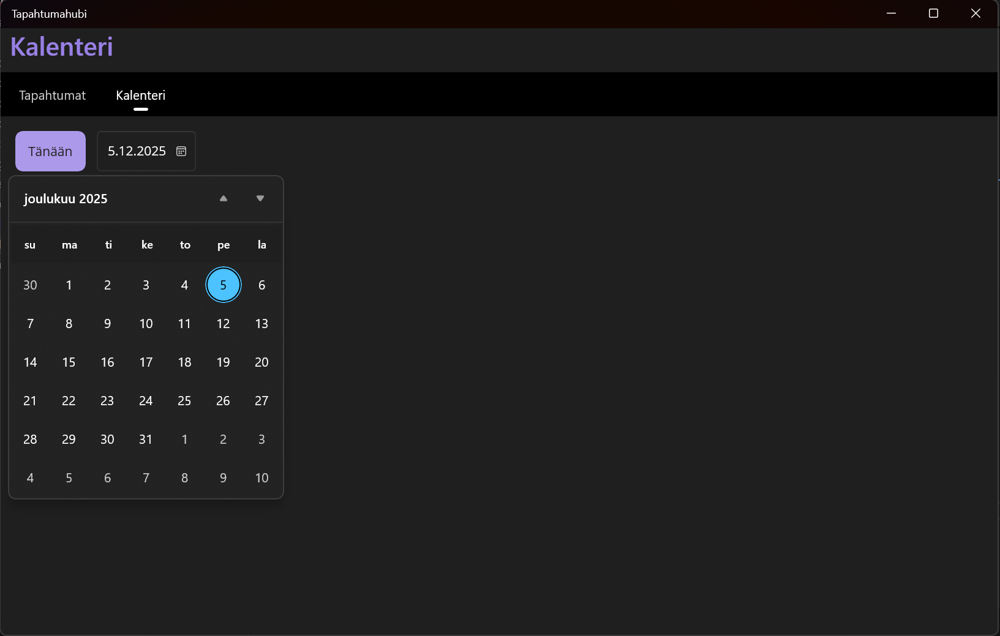

# Tapahtumahubi

Yksinkertainen mutta tuotantotapainen tapahtumahallinnan sovellus (.NET 8 + .NET MAUI, SQLite, EF Core, MVVM).




---

## Sisällys
- [Arkkitehtuuri](#arkkitehtuuri)
- [Vaatimukset ja asennus](#vaatimukset-ja-asennus)
- [Ajaminen (Windows)](#ajaminen-windows)
- [Tietokanta ja migraatiot](#tietokanta-ja-migraatiot)
- [Lokitus](#lokitus)
- [Laatu: koodi, testit, tyyli](#laatu-koodi-testit-ja-tyyli)
- [Projektinhallinta](#projektinhallinta)
- [Käyttöohje (pika)](#käyttöohje-pika)
- [Tunnetut rajoitteet ja jatkokehitys](#tunnetut-rajoitteet-ja-jatkokehitys)
- [Lisenssi](#lisenssi)

## Arkkitehtuuri

**Ratkaisun kerrokset**
- **Tapahtumahubi.Domain** – entiteetit ja validointi (`Event`, `Participant`).
- **Tapahtumahubi.Infrastructure** – EF Core/SQLite: `AppDbContext`, migraatiot (Migrations/), seed (Seed/), kyselyt (Queries/). Käyttää `IDbContextFactory<AppDbContext>`.
- **Tapahtumahubi.App** – .NET MAUI UI (MVVM): *ViewModels* ja *XAML*-näkymät. DI-rekisteröinti `MauiProgram.cs`:ssä. Serilog lokitukseen.
- **Tapahtumahubi.Tests** – xUnit: domain-validoinnit, kyselyt, palvelut, perus-VM-polut.

**Navigaatio/UX**
- Välilehdet: **Tapahtumat** ja **Kalenteri**.
- Uusi/Muokkaa: otsikko, sijainti, päivä, aika, kuvaus, maks. osallistujat.
- Osallistujat: sähköposti uniikki per tapahtuma; kapasiteettiraja.

## Vaatimukset ja asennus

- Windows 10 2004 / 11 (19041+)
- .NET 8 SDK (+ Desktop Runtime)
- (Suositus) EF Core Tools: `dotnet tool install --global dotnet-ef`

**Kloonaus**
```bash
git clone https://github.com/AleksanteriLohja/Tapahtumahubi.git
cd Tapahtumahubi
dotnet restore
```

Ajaminen (Windows)

dotnet build src/Tapahtumahubi.App/Tapahtumahubi.App.csproj -f net8.0-windows10.0.19041.0
dotnet run  --project src/Tapahtumahubi.App/Tapahtumahubi.App.csproj -f net8.0-windows10.0.19041.0

Ensimmäisellä ajolla sovellus luo paikallisen tietokannan:
%LocalAppData%\Tapahtumahubi.App\app.db

Tietokanta ja migraatiot

Migraatiot: src/Tapahtumahubi.Infrastructure/Migrations.
# Aja viimeisin migraatio
dotnet ef database update --project src/Tapahtumahubi.Infrastructure --startup-project src/Tapahtumahubi.App

# Luo uusi migraatio
dotnet ef migrations add <Nimi> --project src/Tapahtumahubi.Infrastructure --startup-project src/Tapahtumahubi.App

App käyttää IDbContextFactory<AppDbContext> ja sijoittaa tietokannan LocalApplicationData-kansioon – hyvä malli UI-sovelluksille.

Lokitus

Serilog kirjoittaa lokit:
%LocalAppData%\Tapahtumahubi.App\logs\app-<päivä>.log

Laatu: koodi, testit ja tyyli

Analyysi: solution kääntyy puhtaasti; varoitukset nostettu virheiksi (katso Directory.Build.props).

Testit
dotnet test --settings coverage.runsettings

Kattavuusraportti talteen (Coverlet collector).

Tyyli: .editorconfig.

Projektinhallinta

Projektisuunnitelma: docs/projektisuunnitelma.md (roolit, rotaatio, sprintit, riskit, DoD).

AI-käyttö: docs/AI-käyttö.md (missä, miksi, miten).

VS Code: .vscode/tasks.json & launch.json (F5 ajaa suoraan).

Release:
dotnet publish src/Tapahtumahubi.App -c Release -f net8.0-windows10.0.19041.0 -r win10-x64 --self-contained false -o publish/win

Käyttöohje (pika)

Luo uusi tapahtuma Tapahtumat-välilehdeltä – täytä kentät ja Tallenna.

Muokkaa/Poista tapahtumakortilta.

Osallistujat: lisää nimi + sähköposti (uniikki per tapahtuma).

Kalenteri: selaa päivämääriä, Tänään palaa tähän päivään.

Tunnetut rajoitteet ja jatkokehitys

Projekti optimoitu Windowsille; muut alustat skelettona.

Jatkossa: haku/suodatus, CSV/ICS-vienti, VM-virhepolkujen testit.

Lisenssi
MIT